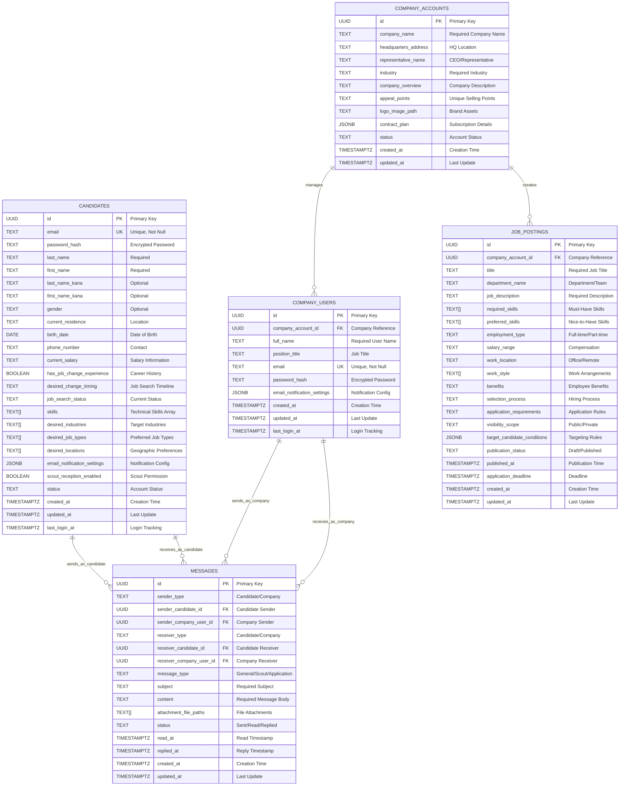

# 🗄️ Database Design - Mokin Recruit

## 🎯 データベース設計概要

Mokin
Recruitのデータベースは、**エンタープライズ級転職プラットフォーム**として設計された、高度に最適化されたPostgreSQLデータベースです。**Domain-Driven
Design (DDD)** と **Clean Architecture**
の原則に従い、拡張性、保守性、パフォーマンスを最大化する設計を採用しています。

---

## 📊 Entity Relationship Diagram (ERD)

### **データベース全体構造**



---

## 🏗️ 設計原則と戦略

### **1. Domain-Driven Design (DDD) 準拠**

```
🎯 Bounded Context分離:
├── 候補者ドメイン (candidates)
├── 企業ドメイン (company_accounts, company_users)
├── 求人ドメイン (job_postings)
└── メッセージドメイン (messages)
```

### **2. データ正規化とパフォーマンスのバランス**

```sql
-- 正規化レベル: 第3正規形 (3NF)
-- 非正規化要素: 配列型・JSONB型による性能最適化
```

### **3. 分散システム対応設計**

```sql
-- UUID主キー採用理由:
-- ✅ 分散システム対応
-- ✅ マイクロサービス移行準備
-- ✅ レプリケーション安全性
-- ✅ セキュリティ向上（推測困難）
```

---

## 📋 テーブル詳細仕様

### **🧑 candidates テーブル**

**目的**: 転職候補者の包括的プロフィール管理

#### **主要設計特徴:**

```sql
-- 高度なデータ型活用
skills TEXT[]                    -- PostgreSQL配列型
email_notification_settings JSONB -- 柔軟な設定管理
scout_reception_enabled BOOLEAN   -- 明示的なプライバシー制御
```

#### **ビジネスロジック:**

- **プライバシー重視**: スカウト受信の明示的制御
- **検索最適化**: スキル配列による高速マッチング
- **国際化対応**: ふりがな項目による日本語処理
- **監査証跡**: 作成・更新・ログイン時刻の完全追跡

#### **インデックス戦略:**

```sql
CREATE INDEX idx_candidates_email ON candidates(email);    -- ログイン高速化
CREATE INDEX idx_candidates_status ON candidates(status);  -- 状態検索
-- 将来的追加予定:
-- CREATE INDEX idx_candidates_skills_gin ON candidates USING GIN(skills);
-- CREATE INDEX idx_candidates_desired_industries_gin ON candidates USING GIN(desired_industries);
```

---

### **🏢 company_accounts テーブル**

**目的**: 企業アカウントのマスター管理

#### **主要設計特徴:**

```sql
-- 企業情報の包括管理
company_name TEXT NOT NULL       -- 必須企業名
industry TEXT NOT NULL          -- 必須業界分類
contract_plan JSONB DEFAULT '{}'  -- 柔軟な契約プラン管理
```

#### **ビジネスロジック:**

- **マルチテナント対応**: 企業ごとの独立データ管理
- **契約管理**: JSONB による柔軟なプラン設定
- **ブランディング**: ロゴ画像パス管理
- **コンプライアンス**: 代表者情報の明確化

---

### **👥 company_users テーブル**

**目的**: 企業内ユーザーの個別管理

#### **主要設計特徴:**

```sql
-- 企業アカウントとの明確な関係
company_account_id UUID NOT NULL REFERENCES company_accounts(id) ON DELETE CASCADE
-- カスケード削除による整合性保証
```

#### **ビジネスロジック:**

- **階層管理**: 企業 → ユーザーの明確な階層
- **権限分離**: 企業レベルとユーザーレベルの権限管理
- **データ整合性**: カスケード削除による完全性保証

---

### **💼 job_postings テーブル**

**目的**: 求人情報の詳細管理

#### **主要設計特徴:**

```sql
-- 高度な検索・マッチング機能
required_skills TEXT[]           -- 必須スキル配列
preferred_skills TEXT[]          -- 優遇スキル配列
target_candidate_conditions JSONB -- AI マッチング条件
work_style TEXT[]               -- 多様な働き方対応
```

#### **ビジネスロジック:**

- **マッチング最適化**: スキル配列による高精度マッチング
- **柔軟な公開制御**: 可視性スコープ管理
- **ワークフロー管理**: 下書き → 公開のステータス管理
- **期限管理**: 応募締切の自動制御

#### **パフォーマンス最適化:**

```sql
CREATE INDEX idx_job_postings_publication_status ON job_postings(publication_status);
-- 将来的追加予定:
-- CREATE INDEX idx_job_postings_required_skills_gin ON job_postings USING GIN(required_skills);
-- CREATE INDEX idx_job_postings_company_status ON job_postings(company_account_id, publication_status);
```

---

### **💬 messages テーブル**

**目的**: 候補者-企業間コミュニケーション管理

#### **主要設計特徴:**

```sql
-- ポリモーフィック関係による柔軟性
sender_type TEXT NOT NULL           -- 送信者タイプ識別
receiver_type TEXT NOT NULL         -- 受信者タイプ識別
-- 4つの外部キー による完全な関係管理
```

#### **ビジネスロジック:**

- **双方向通信**: 候補者 ↔ 企業の完全な通信履歴
- **メッセージタイプ**: 一般・スカウト・応募の分類管理
- **添付ファイル**: 配列による複数ファイル対応
- **既読管理**: 読み取り・返信時刻の追跡

#### **関係性の複雑性管理:**

```sql
-- 4つの外部キー関係:
-- 1. messages → candidates (sender)
-- 2. messages → candidates (receiver)
-- 3. messages → company_users (sender)
-- 4. messages → company_users (receiver)
```

---

## ⚡ パフォーマンス最適化戦略

### **1. インデックス設計**

#### **現在実装済み:**

```sql
-- 基本検索インデックス
CREATE INDEX idx_candidates_email ON candidates(email);
CREATE INDEX idx_candidates_status ON candidates(status);
CREATE INDEX idx_company_users_email ON company_users(email);
CREATE INDEX idx_job_postings_publication_status ON job_postings(publication_status);
CREATE INDEX idx_messages_created_at ON messages(created_at);
```

#### **将来実装予定（需要に応じて）:**

```sql
-- GINインデックス（配列・JSONB高速検索）
CREATE INDEX idx_candidates_skills_gin ON candidates USING GIN(skills);
CREATE INDEX idx_job_postings_required_skills_gin ON job_postings USING GIN(required_skills);
CREATE INDEX idx_candidates_notification_gin ON candidates USING GIN(email_notification_settings);

-- 複合インデックス（複雑クエリ最適化）
CREATE INDEX idx_job_postings_company_status ON job_postings(company_account_id, publication_status);
CREATE INDEX idx_messages_sender_type_created ON messages(sender_type, created_at);
CREATE INDEX idx_candidates_status_login ON candidates(status, last_login_at);
```

### **2. 自動化機能**

#### **トリガー関数:**

```sql
-- 更新時刻自動管理
CREATE OR REPLACE FUNCTION update_updated_at_column()
RETURNS TRIGGER AS $$
BEGIN
    NEW.updated_at = NOW();
    RETURN NEW;
END;
$$ language 'plpgsql';

-- 全テーブルに適用済み
```

### **3. データ型最適化**

#### **配列型の活用:**

```sql
-- 正規化 vs パフォーマンスのバランス
skills TEXT[]               -- 検索頻度が高い項目
desired_industries TEXT[]   -- マッチング処理で使用
work_style TEXT[]          -- 複数選択項目の効率的格納
```

#### **JSONB型の戦略的使用:**

```sql
-- 柔軟性が必要な設定項目
email_notification_settings JSONB  -- 通知設定
contract_plan JSONB               -- 契約プラン詳細
target_candidate_conditions JSONB  -- AI マッチング条件
```

---

## 🔒 セキュリティ設計

### **1. データ保護**

```sql
-- パスワード暗号化
password_hash TEXT NOT NULL  -- bcryptjs による暗号化

-- 機密情報の分離
-- 個人情報は candidates テーブルに集約
-- 企業情報は company_accounts に集約
```

### **2. 外部キー制約**

```sql
-- データ整合性の保証
REFERENCES company_accounts(id) ON DELETE CASCADE
-- 企業削除時の関連データ自動削除

-- 孤立レコード防止
-- すべての外部キーに適切な制約設定
```

### **3. 監査証跡**

```sql
-- 完全な時刻追跡
created_at TIMESTAMP WITH TIME ZONE DEFAULT NOW()
updated_at TIMESTAMP WITH TIME ZONE DEFAULT NOW()
last_login_at TIMESTAMP WITH TIME ZONE

-- メッセージの詳細追跡
read_at TIMESTAMP WITH TIME ZONE
replied_at TIMESTAMP WITH TIME ZONE
```

---

## 🚀 拡張性設計

### **1. 水平スケーリング準備**

```sql
-- UUID主キー による分散対応
id UUID PRIMARY KEY DEFAULT gen_random_uuid()

-- パーティショニング準備
-- 将来的にcreated_at による時系列パーティション可能
```

### **2. マイクロサービス移行準備**

```
🎯 Bounded Context 分離:
├── User Service (candidates, company_users)
├── Company Service (company_accounts)
├── Job Service (job_postings)
└── Message Service (messages)
```

### **3. 新機能追加の柔軟性**

```sql
-- JSONB による設定拡張
email_notification_settings JSONB  -- 新しい通知タイプ追加可能
contract_plan JSONB               -- 新しいプラン要素追加可能
target_candidate_conditions JSONB  -- AI 機能拡張対応
```

---

## 📊 データ容量設計

### **想定スケール**

```
📈 5年後の想定データ量:
├── candidates: 100万レコード
├── company_accounts: 1万レコード
├── company_users: 5万レコード
├── job_postings: 50万レコード
└── messages: 1000万レコード
```

### **ストレージ最適化**

```sql
-- TEXT vs VARCHAR の選択
-- TEXT: 可変長、制限なし（PostgreSQL最適化済み）
-- 固定長が明確な場合のみVARCHAR使用を検討

-- 配列 vs 正規化テーブル
-- 検索頻度が高く、要素数が少ない場合: 配列型
-- 複雑な関係性が必要な場合: 正規化テーブル
```

---

## 🔄 マイグレーション戦略

### **バージョン管理**

```sql
-- スキーマバージョン管理テーブル（将来追加予定）
CREATE TABLE schema_migrations (
    version TEXT PRIMARY KEY,
    applied_at TIMESTAMP WITH TIME ZONE DEFAULT NOW()
);
```

### **後方互換性**

```sql
-- カラム追加時の戦略
-- 1. NULL許可で追加
-- 2. デフォルト値設定
-- 3. 段階的にNOT NULL制約追加

-- 例: 新機能追加時
ALTER TABLE candidates ADD COLUMN new_feature TEXT;
UPDATE candidates SET new_feature = 'default_value';
ALTER TABLE candidates ALTER COLUMN new_feature SET NOT NULL;
```

---

## 📈 監視・メトリクス

### **パフォーマンス監視項目**

```sql
-- クエリパフォーマンス
-- 1. 実行時間が100ms以上のクエリ
-- 2. フルテーブルスキャンの発生
-- 3. インデックス使用率

-- データ増加監視
-- 1. テーブルサイズの推移
-- 2. インデックスサイズの推移
-- 3. 日次データ増加量
```

### **ビジネスメトリクス**

```sql
-- 主要KPI
-- 1. アクティブ候補者数 (last_login_at 基準)
-- 2. 公開求人数 (publication_status = 'PUBLISHED')
-- 3. メッセージ送信数 (日次・月次)
-- 4. マッチング成功率
```

---

## 🎯 今後の改善計画

### **Phase 1: パフォーマンス最適化**

```sql
-- GINインデックス追加
-- 複合インデックス最適化
-- クエリプラン分析・改善
```

### **Phase 2: 機能拡張**

```sql
-- 候補者評価テーブル追加
-- 企業レビューテーブル追加
-- 応募履歴テーブル追加
-- AI推薦ログテーブル追加
```

### **Phase 3: 高可用性対応**

```sql
-- レプリケーション設定
-- パーティショニング実装
-- アーカイブ戦略実装
```

---

## 📚 関連ドキュメント

- [Schema SQL](../database/schema.sql) - 実際のDDL
- [API Specification](./api-specification.md) - API設計
- [Security Architecture](./security-architecture.md) - セキュリティ設計
- [Technical Constraints](./technical-constraints.md) - 技術制約

---

_最終更新: 2024年12月_  
_作成者: Database Architecture Team_
