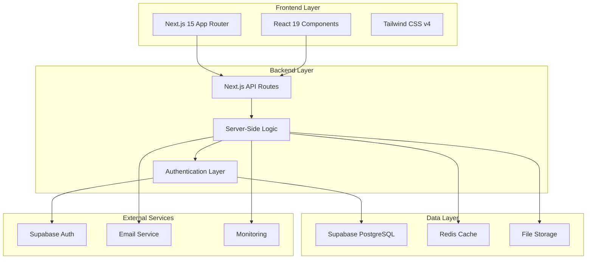
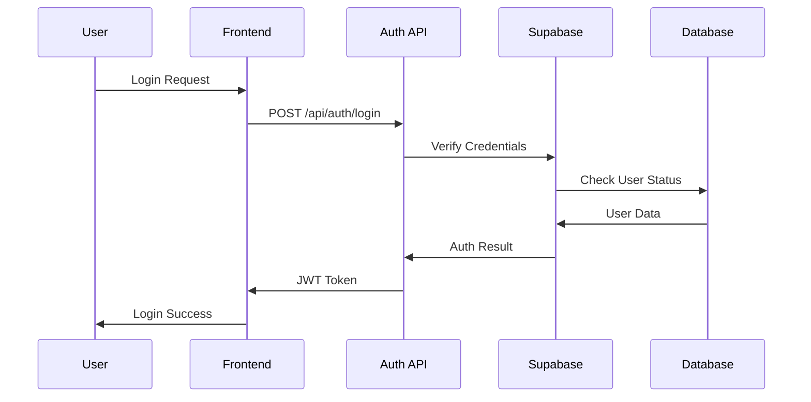
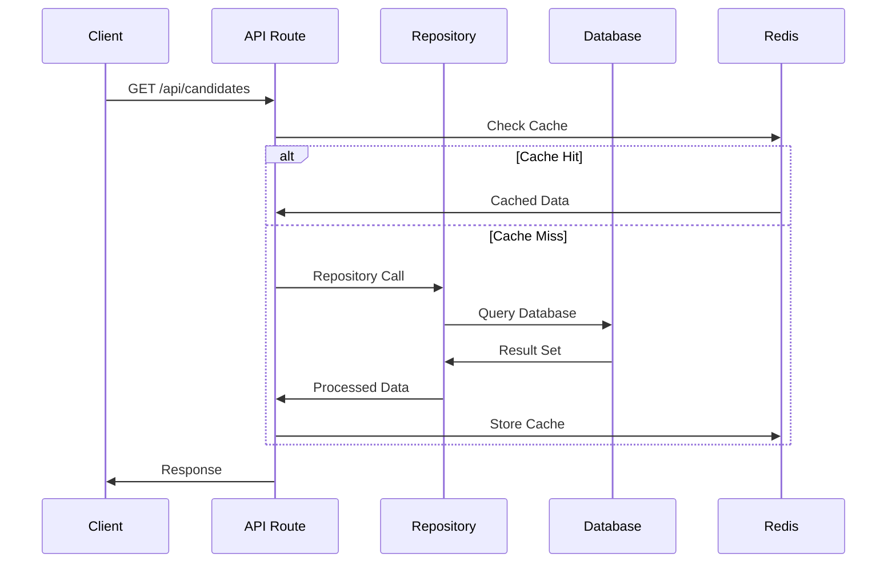

# 🏗️ Architecture Overview - Mokin Recruit

## 🎯 システム概要

Mokin
Recruitは、**エンタープライズ級転職プラットフォーム**として設計された、高度に洗練されたフルスタックWebアプリケーションです。

---

## 📊 アーキテクチャ全体像



---

## 🎨 設計原則

### 1. **Domain-Driven Design (DDD)**

```typescript
// ドメイン境界の明確な分離
packages/shared-types/src/domains/
├── candidate.ts     # 候補者ドメイン
├── company.ts       # 企業ドメイン
├── job.ts           # 求人ドメイン
├── message.ts       # メッセージドメイン
└── admin.ts         # 管理者ドメイン
```

### 2. **Clean Architecture**

```typescript
client/src/lib/server/
├── core/            # ビジネスロジック・エンティティ
├── infrastructure/  # 外部システム連携
├── controllers/     # プレゼンテーション層
└── container/       # 依存性注入
```

### 3. **SOLID原則準拠**

- **S**ingle Responsibility: 各クラス・モジュールは単一責任
- **O**pen/Closed: 拡張に開放、修正に閉鎖
- **L**iskov Substitution: インターフェース契約の遵守
- **I**nterface Segregation: インターフェースの分離
- **D**ependency Inversion: 依存関係の逆転

---

## 🔧 技術スタック詳細

### **フロントエンド**

```json
{
  "framework": "Next.js 15 (App Router)",
  "runtime": "React 19",
  "styling": "Tailwind CSS v4",
  "typeSystem": "TypeScript 5.x",
  "buildTool": "Turbopack"
}
```

### **バックエンド**

```json
{
  "runtime": "Node.js 18+",
  "framework": "Next.js API Routes",
  "database": "Supabase (PostgreSQL)",
  "cache": "Redis 7",
  "authentication": "Supabase Auth + JWT",
  "dependencyInjection": "Inversify.js"
}
```

### **インフラ・運用**

```json
{
  "containerization": "Docker + Docker Compose",
  "monorepo": "npm workspaces",
  "linting": "ESLint + Prettier",
  "testing": "Jest + Testing Library"
}
```

---

## 🗄️ データアーキテクチャ

### **データベース設計**

```sql
-- 主要エンティティ
candidates         -- 候補者情報
company_accounts   -- 企業アカウント
company_users      -- 企業ユーザー
job_postings       -- 求人情報
messages           -- メッセージ

-- 高度な機能
- UUID主キー（分散システム対応）
- JSONB型（柔軟な設定管理）
- 配列型（複数選択項目）
- GINインデックス（高速検索）
```

### **キャッシュ戦略**

```typescript
// 多層キャッシュアーキテクチャ
L1: Next.js Cache        // ページレベル
L2: Redis Cache         // セッション・API結果
L3: Supabase Cache      // データベースクエリ
```

---

## 🔒 セキュリティアーキテクチャ

### **多層防御戦略**

1. **認証層**: JWT + Supabase Auth ハイブリッド
2. **認可層**: Role-Based Access Control (RBAC)
3. **データ層**: Row Level Security (RLS)
4. **通信層**: HTTPS + CORS設定
5. **入力検証**: Zod スキーマバリデーション

```typescript
// セキュリティ実装例
export class AuthService {
  async authenticateUser(token: string): Promise<AuthResult> {
    // 1. JWT検証
    // 2. Supabase Auth検証
    // 3. データベース状態確認
    // 4. 権限チェック
  }
}
```

---

## ⚡ パフォーマンス最適化

### **フロントエンド最適化**

- **Server Components**: サーバーサイドレンダリング
- **Streaming SSR**: 段階的コンテンツ配信
- **Code Splitting**: 動的インポート
- **Image Optimization**: Next.js Image最適化

### **バックエンド最適化**

- **Connection Pooling**: Supabase接続プール
- **Query Optimization**: インデックス最適化
- **Caching Strategy**: Redis活用
- **Batch Operations**: 一括処理

---

## 🔄 データフロー

### **認証フロー**



### **データ取得フロー**



---

## 🚀 拡張性設計

### **マイクロサービス移行準備**

```typescript
// サービス境界の明確化
interface ICandidateService {
  findById(id: string): Promise<Candidate | null>;
  create(data: CreateCandidateRequest): Promise<Candidate>;
  update(id: string, data: UpdateCandidateRequest): Promise<Candidate>;
}

// 将来的なgRPC対応
interface CandidateServiceGRPC extends ICandidateService {
  stream(): AsyncIterable<Candidate>;
}
```

### **リアルタイム機能拡張**

```typescript
// Supabase Realtime統合
const subscription = supabase
  .channel('candidate-updates')
  .on(
    'postgres_changes',
    {
      event: 'UPDATE',
      schema: 'public',
      table: 'candidates',
    },
    payload => {
      // リアルタイム更新処理
    }
  )
  .subscribe();
```

---

## 📊 監視・可観測性

### **メトリクス収集**

- **パフォーマンス**: レスポンス時間、スループット
- **エラー**: エラー率、例外追跡
- **ビジネス**: ユーザー行動、コンバージョン
- **インフラ**: CPU、メモリ、ディスク使用率

### **ログ戦略**

```typescript
// 構造化ログ
logger.info('User authentication', {
  userId: user.id,
  email: user.email,
  timestamp: new Date().toISOString(),
  source: 'AuthController',
});
```

---

## 🎯 品質保証

### **テスト戦略**

```typescript
// 多層テストピラミッド
Unit Tests        // 70% - 個別関数・クラス
Integration Tests // 20% - API・データベース
E2E Tests        // 10% - ユーザーシナリオ
```

### **型安全性**

- **100%型安全**: コンパイル時エラー検出
- **自動型生成**: Supabaseスキーマ連動
- **厳格なTSConfig**: strict mode有効

---

## 🔮 将来ロードマップ

### **短期（3ヶ月）**

- リアルタイム機能実装
- パフォーマンス最適化
- セキュリティ強化

### **中期（6ヶ月）**

- マイクロサービス分離
- API Gateway導入
- 監視システム強化

### **長期（12ヶ月）**

- AI機能統合
- 国際化対応
- モバイルアプリ開発

---

## 📚 関連ドキュメント

- [Technical Constraints](./technical-constraints.md) - 技術的制約
- [Database Design](./database-design.md) - データベース設計
- [Security Architecture](./security-architecture.md) - セキュリティ
- [API Specification](./api-specification.md) - API設計

---

_このアーキテクチャは、スケーラビリティ、保守性、パフォーマンスを重視して設計されています。_
