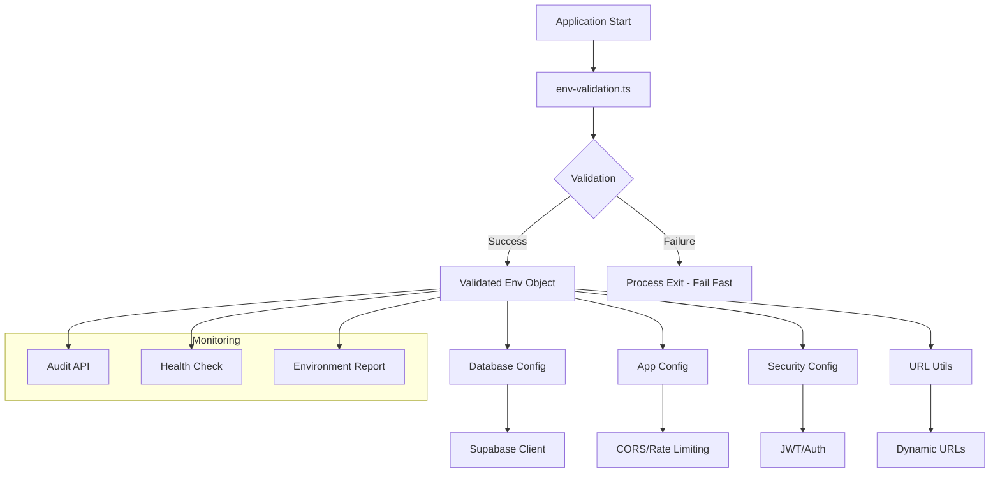

# 🔧 Environment Management - Mokin Recruit

## 📋 概要

Mokin Recruitでは、**12 Factor
App**原則に基づいた**厳密な環境変数管理システム**を実装しています。このシステムは型安全性、セキュリティ、運用性を重視し、開発から本番まで一貫した設定管理を提供します。

---

## 🎯 設計原則

### **1. 12 Factor App準拠**

- 設定を環境変数で外部化
- アプリケーションは環境非依存
- 厳密な設定分離

### **2. 型安全性とfail-fast**

- Zodによる厳密なバリデーション
- 起動時の即座エラー検出
- TypeScript型推論

### **3. セキュリティファースト**

- 秘匿情報のマスク表示
- 本番環境での監査機能無効化
- 強力なデフォルト設定

### **4. 運用性重視**

- 自動化されたセットアップ
- 包括的な監査機能
- 詳細なエラーレポート

---

## 🏗️ アーキテクチャ



---

## 📁 ファイル構成

```
client/
├── src/lib/server/config/
│   ├── env-validation.ts      # 🔥 メインバリデーション
│   ├── database.ts           # Supabase設定
│   ├── app.ts               # アプリケーション設定
│   └── security.ts          # セキュリティ設定
├── .env.example             # 設定テンプレート
├── .env.local              # ローカル設定（Git管理外）
└── scripts/env-setup.sh    # セットアップスクリプト
```

---

## 🚀 クイックスタート

### **1. 自動セットアップ**

```bash
# プロジェクトルートで実行
./scripts/env-setup.sh

# 環境選択:
# 1) Development (Local)
# 2) Production (Vercel)
# 3) Test
# 4) Custom
```

### **2. 手動セットアップ**

```bash
# 1. テンプレートをコピー
cp client/.env.example client/.env.local

# 2. 実際の値を設定
nano client/.env.local

# 3. バリデーション確認
cd client && npm run build
```

---

## ⚙️ 環境変数リファレンス

### **必須変数 (Required)**

| 変数名                      | 形式                            | 例                        | 説明                       |
| --------------------------- | ------------------------------- | ------------------------- | -------------------------- |
| `NODE_ENV`                  | `development\|production\|test` | `development`             | 実行環境                   |
| `SUPABASE_URL`              | `https://*.supabase.co`         | `https://xxx.supabase.co` | SupabaseプロジェクトURL    |
| `SUPABASE_ANON_KEY`         | JWT (100+ chars)                | `eyJhbGci...`             | Supabase匿名キー           |
| `SUPABASE_SERVICE_ROLE_KEY` | JWT (100+ chars)                | `eyJhbGci...`             | Supabaseサービスロールキー |
| `JWT_SECRET`                | String (32+ chars)              | `your-secret-key...`      | JWT署名用シークレット      |

### **オプショナル変数 (Optional)**

| 変数名                 | デフォルト    | 説明                       |
| ---------------------- | ------------- | -------------------------- |
| `PORT`                 | `3000`        | アプリケーションポート     |
| `CORS_ORIGIN`          | `auto-detect` | CORS許可オリジン           |
| `NEXT_PUBLIC_BASE_URL` | `auto-detect` | パブリックベースURL        |
| `JWT_EXPIRES_IN`       | `24h`         | JWT有効期限                |
| `LOG_LEVEL`            | `info`        | ログレベル                 |
| `RATE_LIMIT_WINDOW`    | `900000`      | レート制限ウィンドウ(ms)   |
| `RATE_LIMIT_MAX`       | `100`         | レート制限最大リクエスト数 |

---

## 🔍 バリデーション仕様

### **型安全バリデーション**

```typescript
// env-validation.ts の例
const envSchema = z.object({
  NODE_ENV: z.enum(['development', 'production', 'test']),
  SUPABASE_URL: z
    .string()
    .url()
    .refine(
      url => url.includes('.supabase.co') || url.includes('localhost'),
      'SUPABASE_URL must be a valid Supabase URL'
    ),
  JWT_SECRET: z
    .string()
    .min(32)
    .refine(
      secret => !/^(test|dev|default)/.test(secret.toLowerCase()),
      'JWT_SECRET must not use weak patterns'
    ),
  // ... 他の設定
});
```

### **バリデーションルール**

1. **URL形式チェック**: 有効なURL形式であること
2. **文字数制限**: セキュリティ要件を満たす長さ
3. **パターンチェック**: 弱いパスワードパターンの拒否
4. **必須項目チェック**: 全ての必須変数の存在確認

---

## 🌍 環境別設定

### **開発環境 (Development)**

```bash
NODE_ENV=development
PORT=3000
SUPABASE_URL=https://mjhqeagxibsklugikyma.supabase.co
CORS_ORIGIN=http://localhost:3000
LOG_LEVEL=debug
```

### **本番環境 (Production)**

```bash
NODE_ENV=production
PORT=3000
SUPABASE_URL=https://your-prod-project.supabase.co
CORS_ORIGIN=https://your-domain.com
LOG_LEVEL=info
JWT_SECRET=your-super-strong-64-char-production-secret-key-here
```

### **テスト環境 (Test)**

```bash
NODE_ENV=test
PORT=3001
CORS_ORIGIN=http://localhost:3001
LOG_LEVEL=error
JWT_EXPIRES_IN=1h
```

---

## 🛡️ セキュリティ機能

### **1. 秘匿情報の保護**

```typescript
// 自動マスキング機能
export function getSafeEnvDisplay(env: EnvVars) {
  const maskSecret = (value: string) => {
    return value.substring(0, 4) + '***' + value.substring(value.length - 4);
  };

  return {
    JWT_SECRET: maskSecret(env.JWT_SECRET),
    SUPABASE_SERVICE_ROLE_KEY: maskSecret(env.SUPABASE_SERVICE_ROLE_KEY),
    // ...
  };
}
```

### **2. 本番環境での監査機能制限**

```typescript
// 本番環境では監査APIを無効化
if (process.env.NODE_ENV === 'production') {
  return NextResponse.json(
    { error: 'Environment audit is not available in production' },
    { status: 403 }
  );
}
```

### **3. 強力なデフォルト設定**

- JWT_SECRET: 32文字以上必須（本番では64文字推奨）
- CORS設定: ワイルドカード（`*`）の警告
- URL検証: 厳密なURL形式チェック

---

## 📊 監査・診断機能

### **環境変数監査API**

```bash
# 開発環境でのみ利用可能
curl -X GET "http://localhost:3000/api/admin/env-audit" \
  -H "Authorization: Basic $(echo -n 'admin:mokin-audit-2024' | base64)"
```

**レスポンス例:**

```json
{
  "success": true,
  "audit": {
    "summary": {
      "environment": "development",
      "totalVariables": 15,
      "requiredVariables": 5,
      "optionalVariables": 5,
      "missingVariables": 0
    },
    "validation": {
      "status": "success",
      "errors": [],
      "warnings": []
    },
    "security": {
      "jwtSecretStrength": "medium",
      "corsConfiguration": "safe",
      "urlConfiguration": "valid"
    },
    "recommendations": []
  }
}
```

### **設定テスト機能**

```bash
# Supabase接続テスト
curl -X POST "http://localhost:3000/api/admin/env-audit" \
  -H "Authorization: Basic $(echo -n 'admin:mokin-audit-2024' | base64)" \
  -H "Content-Type: application/json" \
  -d '{"testType": "connection"}'

# JWT設定テスト
curl -X POST "http://localhost:3000/api/admin/env-audit" \
  -H "Authorization: Basic $(echo -n 'admin:mokin-audit-2024' | base64)" \
  -H "Content-Type: application/json" \
  -d '{"testType": "jwt"}'
```

---

## 🚀 デプロイメント

### **Vercelデプロイ手順**

```bash
# 1. Vercel CLI セットアップ
npm install -g vercel
vercel login

# 2. プロジェクト初期化
vercel

# 3. 環境変数設定
vercel env add NODE_ENV production
vercel env add SUPABASE_URL production
vercel env add SUPABASE_ANON_KEY production
vercel env add SUPABASE_SERVICE_ROLE_KEY production
vercel env add JWT_SECRET production

# 4. 本番デプロイ
vercel --prod
```

### **環境変数の優先順位**

1. Vercel環境変数設定
2. `.env.production`
3. `.env.local`
4. `.env`
5. デフォルト値

---

## 🔧 トラブルシューティング

### **よくある問題と解決策**

#### **1. バリデーションエラー**

```bash
# エラー例
Environment variable validation failed:
JWT_SECRET: JWT_SECRET must be at least 32 characters for security

# 解決策
JWT_SECRET=your-super-secret-jwt-key-32-chars-minimum
```

#### **2. Supabase接続エラー**

```bash
# 確認方法
curl -X POST "http://localhost:3000/api/admin/env-audit" \
  -H "Authorization: Basic $(echo -n 'admin:mokin-audit-2024' | base64)" \
  -d '{"testType": "connection"}'

# よくある原因
- SUPABASE_URL の形式エラー
- SUPABASE_ANON_KEY の期限切れ
- ネットワーク接続問題
```

#### **3. CORS エラー**

```bash
# 確認
CORS_ORIGIN=http://localhost:3000  # 開発環境
CORS_ORIGIN=https://your-domain.com  # 本番環境

# 動的設定の確認
curl "http://localhost:3000/api/admin/env-audit" | jq '.audit.security.corsConfiguration'
```

---

## 📈 パフォーマンス最適化

### **1. 環境変数キャッシュ**

```typescript
// バリデーション済み環境変数をキャッシュ
let validatedEnv: EnvVars | null = null;

export function getValidatedEnv(): EnvVars {
  if (validatedEnv) {
    return validatedEnv; // キャッシュから返却
  }
  // バリデーション実行...
}
```

### **2. 起動時バリデーション**

```typescript
// サーバー起動時に一度だけバリデーション
if (typeof window === 'undefined') {
  try {
    getValidatedEnv();
  } catch (error) {
    if (process.env.NODE_ENV === 'production') {
      process.exit(1); // fail-fast
    }
  }
}
```

---

## 🔄 CI/CD統合

### **GitHub Actions例**

```yaml
name: Environment Validation

on: [push, pull_request]

jobs:
  validate-env:
    runs-on: ubuntu-latest
    steps:
      - uses: actions/checkout@v3
      - uses: actions/setup-node@v3
        with:
          node-version: '18'

      - name: Install dependencies
        run: cd client && npm ci

      - name: Validate environment variables
        run: cd client && npm run build
        env:
          NODE_ENV: test
          SUPABASE_URL: ${{ secrets.SUPABASE_URL }}
          SUPABASE_ANON_KEY: ${{ secrets.SUPABASE_ANON_KEY }}
          SUPABASE_SERVICE_ROLE_KEY: ${{ secrets.SUPABASE_SERVICE_ROLE_KEY }}
          JWT_SECRET: ${{ secrets.JWT_SECRET }}
```

---

## 📚 関連ドキュメント

- [Environment Variables Guide](./environment-variables.md)
- [Deployment Guide](./deployment-guide.md)
- [Security Best Practices](../security/best-practices.md)
- [Troubleshooting Guide](../getting-started/troubleshooting.md)

---

## 🆘 サポート

### **問題報告**

1. **環境変数監査レポート**を取得
2. **ログファイル**を確認
3. **GitHub Issues**で報告

### **緊急時対応**

```bash
# 1. 環境変数のバックアップ確認
ls -la client/.env.local.backup.*

# 2. 最新のバックアップを復元
cp client/.env.local.backup.YYYYMMDD_HHMMSS client/.env.local

# 3. アプリケーション再起動
npm run dev
```

---

**🔒 セキュリティ注意事項:**

- 本番環境の環境変数は決してコードリポジトリにコミットしない
- 定期的にJWT_SECRETやAPIキーをローテーションする
- 監査ログを定期的に確認する
- 不要な環境変数は削除する

---

_このドキュメントは、Mokin Recruitの環境変数管理システムv2.0に基づいています。_
