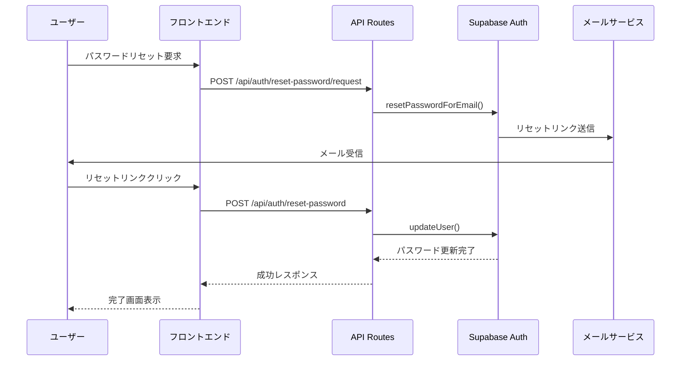

# パスワードリセット機能

## 概要

Mokin Recruitのパスワードリセット機能は、Supabase
Authを基盤とした安全で使いやすいパスワード再設定システムです。

## 技術仕様

### アーキテクチャ



### セキュリティ機能

1. **トークンベース認証**

   - Supabase Authによる安全なトークン生成
   - 1時間の有効期限
   - ワンタイムユース

2. **パスワード強度チェック**

   - 8文字以上
   - 大文字・小文字・数字・特殊文字を含む
   - リアルタイムバリデーション

3. **セキュリティ考慮事項**
   - メールアドレス列挙攻撃対策
   - レート制限（Supabase側で実装）
   - HTTPS必須

## 実装詳細

### ファイル構成

```
client/src/
├── app/
│   ├── auth/
│   │   └── reset-password/
│   │       ├── page.tsx              # パスワードリセット要求ページ
│   │       ├── new/
│   │       │   └── page.tsx          # 新しいパスワード設定ページ
│   │       └── complete/
│   │           └── page.tsx          # 完了ページ
│   └── api/
│       └── auth/
│           └── reset-password/
│               ├── request/
│               │   └── route.ts      # リセット要求API
│               └── route.ts          # リセット実行API
├── components/
│   └── auth/
│       ├── ForgotPasswordForm.tsx    # リセット要求フォーム
│       └── ResetPasswordForm.tsx     # リセット実行フォーム
└── lib/server/auth/
    └── supabaseAuth.ts              # Supabase Auth統合
```

### APIエンドポイント

#### POST /api/auth/reset-password/request

パスワードリセット要求を処理します。

**リクエスト**

```json
{
  "email": "user@example.com"
}
```

**レスポンス**

```json
{
  "success": true,
  "message": "パスワードリセット用のリンクを送信しました。メールをご確認ください。"
}
```

#### POST /api/auth/reset-password

パスワードリセットを実行します。

**リクエスト**

```json
{
  "accessToken": "supabase_access_token",
  "refreshToken": "supabase_refresh_token",
  "newPassword": "NewSecurePassword123!"
}
```

**レスポンス**

```json
{
  "success": true,
  "message": "パスワードが正常にリセットされました。新しいパスワードでログインしてください。"
}
```

### コンポーネント仕様

#### ForgotPasswordForm

- **機能**: メールアドレス入力とリセット要求
- **バリデーション**: メールアドレス形式チェック
- **状態管理**: 送信中・成功・エラー状態

#### ResetPasswordForm

- **機能**: 新しいパスワード設定
- **バリデーション**: パスワード強度チェック
- **セキュリティ**: パスワード表示/非表示切り替え
- **UX**: リアルタイム要件表示

## 設定

### 環境変数

```bash
# Supabase設定
NEXT_PUBLIC_SUPABASE_URL=your_supabase_project_url
NEXT_PUBLIC_SUPABASE_ANON_KEY=your_supabase_anon_key
SUPABASE_URL=your_supabase_project_url
SUPABASE_ANON_KEY=your_supabase_anon_key
SUPABASE_SERVICE_ROLE_KEY=your_supabase_service_role_key

# セキュリティ設定
JWT_SECRET=your_jwt_secret_key

# CORS設定
CORS_ORIGIN=http://localhost:3000
```

### Supabase設定

`client/supabase/config.toml`で以下を設定：

```toml
[auth.email]
enable_signup = true
double_confirm_changes = true
enable_confirmations = false
secure_password_change = false
max_frequency = "1s"
otp_length = 6
otp_expiry = 3600
```

## 使用方法

### 基本的な流れ

1. **パスワードリセット要求**

   - `/auth/reset-password`にアクセス
   - メールアドレスを入力
   - 「リセットリンクを送信」をクリック

2. **メール確認**

   - 受信したメールのリンクをクリック
   - `/auth/reset-password`に自動遷移

3. **新しいパスワード設定**

   - パスワード要件を満たす新しいパスワードを入力
   - パスワード確認で同じパスワードを再入力
   - 「パスワードをリセット」をクリック

4. **完了**
   - 成功メッセージ表示
   - 3秒後に自動的にログインページへ遷移

### エラーハンドリング

- **無効なメールアドレス**: フォームバリデーションでリアルタイム表示
- **存在しないメールアドレス**: セキュリティ上、成功メッセージを表示
- **期限切れトークン**: エラーメッセージと再要求への誘導
- **パスワード要件不適合**: リアルタイム要件チェック表示

## テスト

### 手動テスト手順

1. **正常系テスト**

   ```bash
   # 開発サーバー起動
   npm run dev

   # ブラウザで http://localhost:3000/auth/reset-password にアクセス
   # 有効なメールアドレスでテスト
   ```

2. **異常系テスト**
   - 無効なメールアドレス入力
   - 存在しないメールアドレス入力
   - 期限切れトークンでのアクセス
   - 弱いパスワードでのリセット試行

### APIテスト

```bash
# パスワードリセット要求
   curl -X POST http://localhost:3000/api/auth/reset-password/request \
  -H "Content-Type: application/json" \
  -d '{"email":"test@example.com"}'

# パスワードリセット実行（トークンが必要）
curl -X POST http://localhost:3000/api/auth/reset-password \
  -H "Content-Type: application/json" \
  -d '{
    "tokenHash":"token_hash_from_email",
    "type":"recovery",
    "accessToken":"access_token_from_url",
    "refreshToken":"refresh_token_from_url",
    "password":"NewPassword123!",
    "confirmPassword":"NewPassword123!"
  }'
```

### 開発・デバッグ用テストAPI

開発環境では以下のテストエンドポイントが利用可能です：

```bash
# システム全体のテスト
curl "http://localhost:3000/api/test/password-reset"

# メール送信テスト
curl "http://localhost:3000/api/test/password-reset?send=true&email=test@example.com"

# テスト用メール送信API
curl -X POST http://localhost:3000/api/test/password-reset \
  -H "Content-Type: application/json" \
  -d '{"email":"test@example.com"}'
```

**テスト結果の確認**

- **Inbucket**: http://127.0.0.1:54324 でテストメールを確認
- **Supabase Studio**: http://127.0.0.1:54323 でユーザー状態を確認
- **ログ**: アプリケーションログでデバッグ情報を確認

## トラブルシューティング

### よくある問題

1. **メールが届かない**

   - Supabase Authの設定確認
   - 迷惑メールフォルダの確認
   - SMTP設定の確認（本番環境）

2. **リセットリンクが機能しない**

   - CORS_ORIGIN環境変数の確認
   - Supabaseのredirect URL設定確認

3. **パスワード更新エラー**
   - トークンの有効期限確認
   - パスワード要件の確認
   - Supabase接続状態の確認

### ログ確認

```bash
# アプリケーションログ
tail -f client/logs/all.log

# エラーログ
tail -f client/logs/error.log
```

## 今後の拡張予定

1. **MFA対応**

   - 2段階認証との統合
   - SMS認証オプション

2. **セキュリティ強化**

   - パスワード履歴チェック
   - 地理的制限

3. **UX改善**
   - パスワード強度メーター
   - ソーシャルログイン統合

## 関連ドキュメント

- [認証システム概要](./authentication.md)
- [Supabase設定ガイド](../deployment/supabase-setup.md)
- [セキュリティガイドライン](../architecture/security.md)
